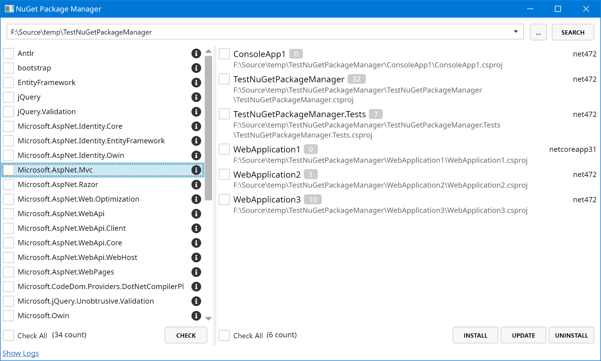
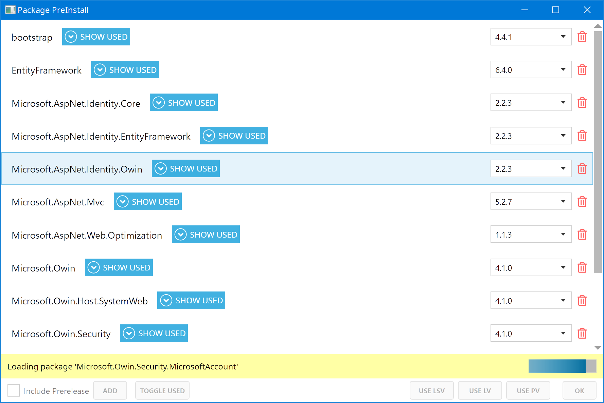
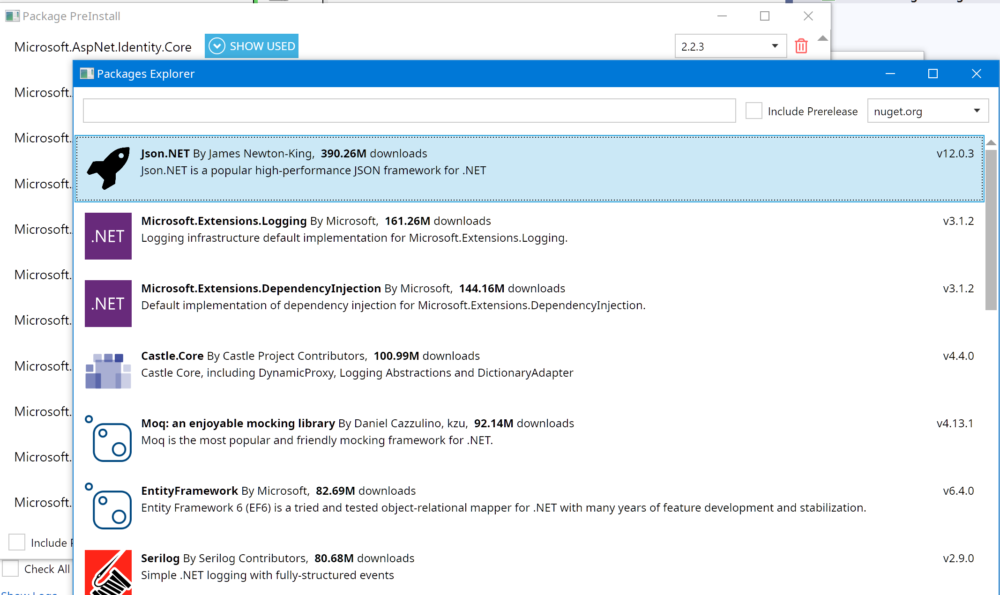

# NuGet Package Manager UI
A NuGet package manager tools for C# project(s).

## TODO
- [x] .Net framework project
- [ ] .Net Core project
      
## About the project
因为visual studio 只能管理解决方案中的NuGet包，但是在我的工作中，还有很多项目不在解决方案中，当遇到package包升级或者统一版本的时候，在vs中就无法操作了。 所以，就写了这么一个UI工具来管理某个解决方案文件夹下的所有项目。

目前的功能有：  
- 批量安装包到指定项目
- 批量卸载包（可以指定项目或不指定）
- 统一更新包版本（可以指定项目或不指定）

## Screenshot

